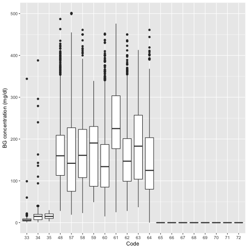
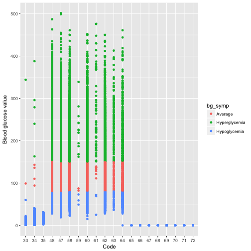
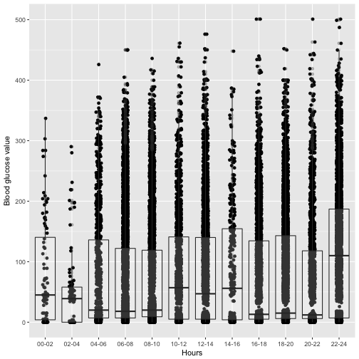

Capstone Project, Foundations of Data Science
========================================================
author: Ashwini Bhatte
date: 19th August 2017
autosize: true

Insulin dependent Diabetes Mellitus
====================================

- Also known as Type 1 diabetes
- Autoimmune disease characterised by body's inability to produce insulin
- Onset in childhood, but can also develop in adults (late 30s and early 40s).
- Cause unknown
- Patient require lifelong insulin therapy
- It is estimated that about 80,000 children develop Type 1 diabetes each year.

Pathophysiology of Insulin dependent diabetes mellitus
========================================================

Most patients require two or more injections of insulin daily, based on self monitoring of
blood glucose measurements.

Outpatient management relies on diet, exercise and exogenous insulin

Blood glucose concentrations
========================================================

Patients with diabetes face a lifelong challenge to achieve and maintain blood glucose levels as close to the normal range as possible.

- Hyperglycemia: BG > 200 mg/dl
- Average BG: 80 - 150 mg/dl
- Hypoglycemia: BG < 80 mg/dl

But it is desirable to keep 90% of all BG measurements < 200 mg/dl.

Objective
================
- Extract understandable patterns and associations from data through data visualisation.

Exploratory Data analysis
=========================================================

Relation between Code and BG concentration
***

Code      |   Activity
--------- | -----------
33        | Regular insulin dose
34        | NPH insulin dose
35        | UltraLente insulin dose
48        | Unspecified blood glucose measurement
57        | Unspecified blood glucose measurement
58        | Pre-breakfast blood glucose measurement
59        | Post-breakfast blood glucose measurement
60        | Pre-lunch blood glucose measurement
61        | Post-lunch blood glucose measurement
62        | Pre-supper blood glucose measurement
63        | Post-supper blood glucose measurement
64        | Pre-snack blood glucose measurement
65        | Hypoglycemic symptoms
66        | Typical meal ingestion
67        | More-than-usual meal ingestion
68        | Less-than-usual meal ingestion
69        | Typical exercise activity
70        | More-than-usual exercise activity
71        | Less-than-usual exercise activity
72        | Unspecified special event

Exploratory Data analysis
=========================================================

Distribution of BG symptoms across Codes

Exploratory Data analysis
=========================================================

Distribution of BG measurements over 24 hours

Exploratory Data analysis
=========================================================

Distribution of BG symptoms over 24 hours
